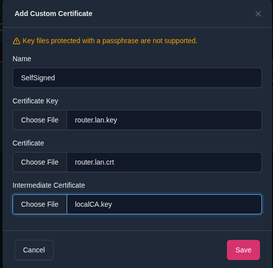
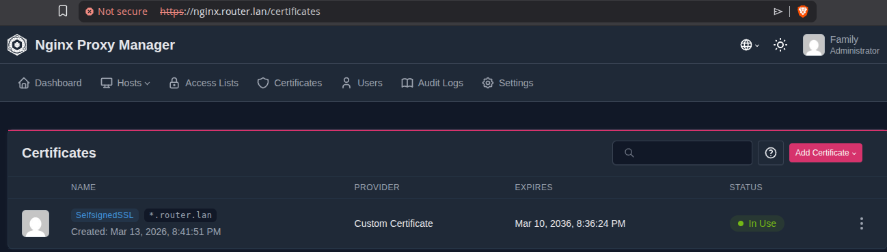
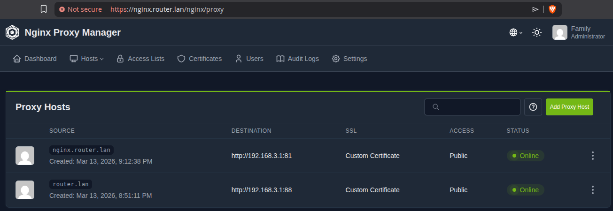
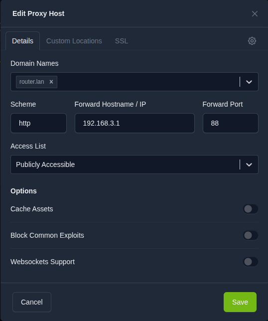
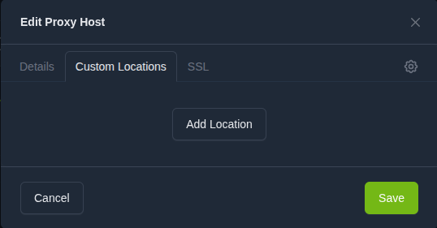
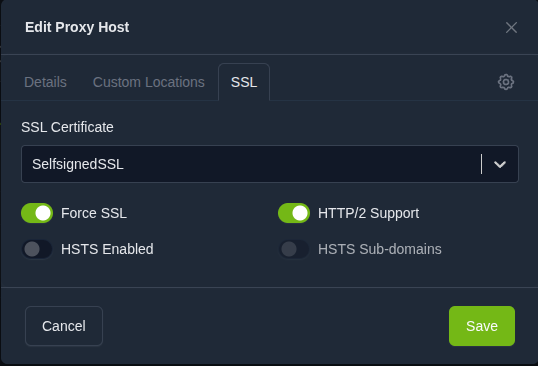

# Nginx Proxy Manager + самоподписанные сертификаты для локальной сети

## С какой проблемой я столкнулся

Я хотел, чтобы все мои домашние сервисы (Grafana, NAS, Home Assistant и другие) были доступны по красивым и понятным адресам:

- `https://grafana.router.lan`
- `https://nas.router.lan`
- `https://home.router.lan`

…и чтобы при этом **не нужно было указывать порты** и везде работал HTTPS.

### Что не подходило:

1. **Просто по IP + порт** — неудобно запоминать и вводить каждый раз (`192.168.3.1:3000`).
2. **Обычные самоподписанные сертификаты** (на каждый сервис отдельно) — браузер каждый раз выдаёт страшное предупреждение «Ваше соединение не защищено».
3. **Let’s Encrypt / публичные сертификаты** — невозможно получить для внутренних доменов `*.router.lan`, потому что они не видны из интернета и не проходят валидацию.

### Решение, которое я выбрал:

Создать **свой локальный центр сертификации (CA)** и сгенерировать один **wildcard-сертификат `*.router.lan`**.  
После установки корневого сертификата `localCA.crt` в доверенные корни на всех устройствах (ПК, телефон, планшет) браузеры перестают ругаться, и всё работает как с настоящим HTTPS.

Плюс Nginx Proxy Manager берёт на себя reverse-proxy, так что все сервисы «прячутся» за одним красивым доменом и одним портом 443.

Именно поэтому мне и понадобились **самоподписанные wildcard-сертификаты + свой CA** 

Это руководство описывает настройку **Nginx Proxy Manager** с использованием **самоподписанных wildcard-сертификатов** для локальных сервисов.

Все сервисы будут доступны по **HTTPS без указания портов**.

---

## Архитектура

После настройки система будет работать так:

```
Internet / LAN
        │
        │
   Nginx Proxy Manager
      80 / 443
        │
 ┌──────┴───────────────┐
 │                      │
grafana.router.lan   nas.router.lan
192.168.3.1:3000   192.168.3.1:5000
```

LuCI будет перенесён на порт:

**http://192.168.3.1:88**

---

## Что делает скрипт

Скрипт `setup-certs.sh` автоматически:

1. Создаёт локальный центр сертификации (CA)
2. Генерирует wildcard-сертификат `*.router.lan`
3. Переносит LuCI с порта **80 → 88**
4. Переносит HTTPS LuCI **443 → 444**
5. Добавляет wildcard DNS-запись в dnsmasq
6. Перезапускает сервисы OpenWrt
7. Подготавливает каталоги для Docker

---

## Требования

Перед началом убедитесь, что установлены:

- Docker
- Docker Compose
- OpenSSL

---

## Структура проекта

После настройки структура будет выглядеть так:

```
npm/
├── docker-compose.yml
├── setup-certs.sh
├── README.md
├── certs/
│   ├── localCA.crt
│   ├── localCA.key
│   ├── router.lan.crt
│   └── router.lan.key
├── data/
└── letsencrypt/
```

---

## 1. Генерация сертификатов и настройка роутера

Сделайте скрипт исполняемым:

```bash
chmod +x setup-certs.sh
```

Запустите его:

```bash
./setup-certs.sh
```

Скрипт выполнит:
- генерацию сертификатов
- перенос LuCI на порт 88
- настройку dnsmasq

После выполнения LuCI будет доступен по адресу:

**http://192.168.3.1:88**

---

## 2. Запуск Nginx Proxy Manager

Запустите контейнер:

```bash
docker compose up -d
```

После запуска веб-панель будет доступна:

**http://192.168.3.1:81**

Данные для входа по умолчанию:

- **Email:** `admin@example.com`
- **Password:** `changeme`

После входа система попросит изменить пароль.

---

## 3. Добавление сертификата в Nginx Proxy Manager

Откройте панель управления:

**http://ROUTER_IP:81**

Перейдите:  
**SSL Certificates** → **Add SSL Certificate** → **Custom**

Заполните поля:

### Name
```
router-lan-wildcard
```

### Certificate Key
Содержимое файла:  
`certs/router.lan.key`

### Certificate
Содержимое файла:  
`certs/router.lan.crt`

### Intermediate Certificate
Содержимое файла:  
`certs/localCA.crt`

Сохраните сертификат.

---





## 4. Настройка Proxy Host

Перейдите:  
**Proxy Hosts** → **Add Proxy Host**

Пример для Grafana:

### Domain Name
```
grafana.router.lan
```

### Forward Hostname / IP
```
192.168.1.50
```

### Forward Port
```
3000
```


Откройте вкладку **SSL** и включите:
- **Enable SSL**
- **Force SSL**
- **HTTP/2 Support**

Выберите сертификат:  
**router-lan-wildcard**

Сохраните.








---

## 5. Установка локального CA в систему (опционально)

Чтобы браузер не показывал предупреждение о безопасности, установите локальный CA-сертификат.

Файл: `certs/localCA.crt`

### Linux
```bash
sudo cp localCA.crt /usr/local/share/ca-certificates/
sudo update-ca-certificates
```

### Windows
1. Откройте `certmgr.msc`
2. Перейдите в **Trusted Root Certification Authorities**
3. Импортируйте `localCA.crt`

### macOS
1. Откройте **Keychain Access**
2. Импортируйте `localCA.crt`
3. Установите **Always Trust**

---

## 6. Проверка работы

После настройки должны открываться:

- https://grafana.router.lan
- https://nas.router.lan
- https://home.router.lan

Все соединения будут использовать HTTPS.

---

## DNS-настройка

В dnsmasq добавляется wildcard-запись:

```
address=/.router.lan/192.168.3.1
```

Это означает, что любые домены `*.router.lan` автоматически указывают на роутер.

---
